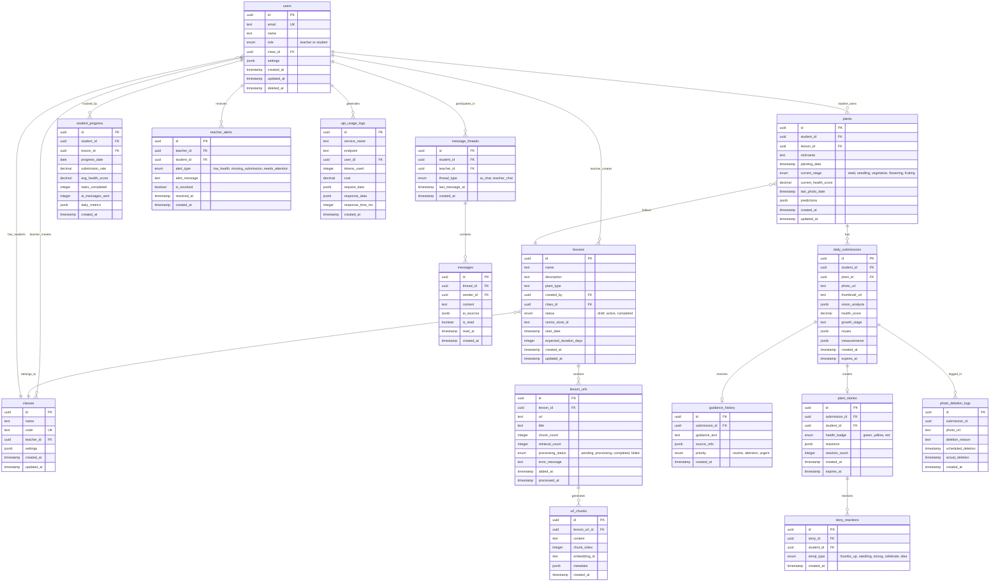

# **Entity Relationship Diagram (ERD)**

## **Project: GardenSnap - AI-Powered Educational Garden Learning Platform**

**Version:** 1.0  
**Date:** December 2024  
**Author:** Database Architecture Team  
**Target Platform:** Supabase (PostgreSQL)

---

## **1. Introduction**

This Entity Relationship Diagram document defines the database schema for the GardenSnap platform, designed specifically for implementation in Supabase. The schema supports all functional requirements identified in the FRD while leveraging Supabase's built-in features including:

- Row Level Security (RLS) for multi-tenant data isolation
- Real-time subscriptions for instant updates
- Storage integration for photo management
- Edge Functions for serverless processing
- Built-in authentication with role management

The database design follows PostgreSQL best practices and includes considerations for Supabase-specific features like automatic timestamp management, soft deletes, and optimized indexing for real-time queries.

---

## **2. Database Design Principles**

### **2.1 Supabase-Specific Considerations**

1. **UUID Primary Keys**: All tables use UUID primary keys for global uniqueness
2. **Automatic Timestamps**: Leverage Supabase's automatic `created_at` and `updated_at` columns
3. **Soft Deletes**: Include `deleted_at` columns for data recovery capabilities
4. **RLS Policies**: Design supports row-level security for teacher/student access control
5. **Real-time Optimization**: Indexes support efficient real-time subscription queries
6. **Storage References**: Photo URLs reference Supabase Storage bucket paths

### **2.2 Naming Conventions**

- **Tables**: `snake_case` plural (e.g., `users`, `daily_submissions`)
- **Columns**: `snake_case` (e.g., `health_score`, `plant_type`)
- **Foreign Keys**: `{referenced_table_singular}_id` (e.g., `student_id`, `lesson_id`)
- **Indexes**: `idx_{table}_{column(s)}` (e.g., `idx_daily_submissions_created_at`)
- **Constraints**: `{table}_{constraint_type}_{columns}` (e.g., `students_email_unique`)

---

## **3. Entity Relationship Diagram**



---

## **4. Table Definitions**

### **4.1 Core User Tables**

#### **users**
Primary user table supporting both teacher and student roles.

| Column | Type | Constraints | Description |
|--------|------|-------------|-------------|
| id | UUID | PK, DEFAULT uuid_generate_v4() | Unique user identifier |
| email | TEXT | UNIQUE, NOT NULL | User email address |
| name | TEXT | NOT NULL | Display name |
| role | ENUM | NOT NULL, CHECK(role IN ('teacher', 'student')) | User role |
| class_id | UUID | FK → classes.id, NULL for teachers | Student's class assignment |
| settings | JSONB | DEFAULT '{}' | User preferences (notifications, language, etc.) |
| created_at | TIMESTAMP | DEFAULT NOW() | Account creation time |
| updated_at | TIMESTAMP | DEFAULT NOW() | Last profile update |
| deleted_at | TIMESTAMP | NULL | Soft delete timestamp |

**Indexes:**
- `idx_users_email` ON (email)
- `idx_users_class_id` ON (class_id) WHERE role = 'student'
- `idx_users_role` ON (role)

#### **classes**
Classroom entities managed by teachers.

| Column | Type | Constraints | Description |
|--------|------|-------------|-------------|
| id | UUID | PK, DEFAULT uuid_generate_v4() | Unique class identifier |
| name | TEXT | NOT NULL | Class name |
| code | TEXT | UNIQUE, NOT NULL | Join code for students |
| teacher_id | UUID | FK → users.id, NOT NULL | Class owner |
| settings | JSONB | DEFAULT '{}' | Class configuration |
| created_at | TIMESTAMP | DEFAULT NOW() | Class creation time |
| updated_at | TIMESTAMP | DEFAULT NOW() | Last modification |

**Indexes:**
- `idx_classes_code` ON (code)
- `idx_classes_teacher_id` ON (teacher_id)

### **4.2 Lesson Management Tables**

#### **lessons**
Educational lessons with curated content.

| Column | Type | Constraints | Description |
|--------|------|-------------|-------------|
| id | UUID | PK, DEFAULT uuid_generate_v4() | Unique lesson identifier |
| name | VARCHAR(100) | NOT NULL | Lesson name |
| description | VARCHAR(500) | NULL | Lesson description |
| plant_type | TEXT | NOT NULL | Type of plant for this lesson |
| created_by | UUID | FK → users.id, NOT NULL | Teacher who created lesson |
| class_id | UUID | FK → classes.id, NOT NULL | Associated class |
| status | ENUM | DEFAULT 'draft' | draft, active, completed |
| vector_store_id | TEXT | NULL | Pinecone index identifier |
| start_date | TIMESTAMP | NULL | When lesson becomes active |
| expected_duration_days | INTEGER | NOT NULL, CHECK > 0 | Expected lesson length |
| created_at | TIMESTAMP | DEFAULT NOW() | Creation timestamp |
| updated_at | TIMESTAMP | DEFAULT NOW() | Last modification |

**Indexes:**
- `idx_lessons_class_status` ON (class_id, status)
- `idx_lessons_created_by` ON (created_by)

**Constraints:**
- Only one lesson per class can have status = 'active'

#### **lesson_urls**
Educational URLs for lesson content.

| Column | Type | Constraints | Description |
|--------|------|-------------|-------------|
| id | UUID | PK, DEFAULT uuid_generate_v4() | Unique URL identifier |
| lesson_id | UUID | FK → lessons.id, NOT NULL, ON DELETE CASCADE | Parent lesson |
| url | TEXT | NOT NULL | Educational content URL |
| title | TEXT | NULL | Extracted or provided title |
| chunk_count | INTEGER | DEFAULT 0 | Number of text chunks created |
| retrieval_count | INTEGER | DEFAULT 0 | RAG query count |
| processing_status | ENUM | DEFAULT 'pending' | pending, processing, completed, failed |
| error_message | TEXT | NULL | Processing error details |
| added_at | TIMESTAMP | DEFAULT NOW() | When URL was added |
| processed_at | TIMESTAMP | NULL | Processing completion time |

**Indexes:**
- `idx_lesson_urls_lesson_id` ON (lesson_id)
- `idx_lesson_urls_status` ON (processing_status)

#### **url_chunks**
Processed content chunks for RAG.

| Column | Type | Constraints | Description |
|--------|------|-------------|-------------|
| id | UUID | PK, DEFAULT uuid_generate_v4() | Unique chunk identifier |
| lesson_url_id | UUID | FK → lesson_urls.id, NOT NULL, ON DELETE CASCADE | Source URL |
| content | TEXT | NOT NULL | Chunk text content |
| chunk_index | INTEGER | NOT NULL | Order within document |
| embedding_id | TEXT | NULL | Pinecone vector ID |
| metadata | JSONB | DEFAULT '{}' | Additional chunk metadata |
| created_at | TIMESTAMP | DEFAULT NOW() | Processing timestamp |

**Indexes:**
- `idx_url_chunks_lesson_url` ON (lesson_url_id, chunk_index)

### **4.3 Plant and Submission Tables**

#### **plants**
Individual student plants.

| Column | Type | Constraints | Description |
|--------|------|-------------|-------------|
| id | UUID | PK, DEFAULT uuid_generate_v4() | Unique plant identifier |
| student_id | UUID | FK → users.id, NOT NULL | Plant owner |
| lesson_id | UUID | FK → lessons.id, NOT NULL | Associated lesson |
| nickname | VARCHAR(30) | NULL | Student's name for plant |
| planting_date | TIMESTAMP | NOT NULL | When plant was started |
| current_stage | ENUM | DEFAULT 'seed' | seed, seedling, vegetative, flowering, fruiting |
| current_health_score | DECIMAL(5,2) | NULL, CHECK BETWEEN 0 AND 100 | Latest health percentage |
| last_photo_date | TIMESTAMP | NULL | Most recent submission |
| predictions | JSONB | DEFAULT '{}' | Growth predictions |
| created_at | TIMESTAMP | DEFAULT NOW() | Record creation |
| updated_at | TIMESTAMP | DEFAULT NOW() | Last update |

**Indexes:**
- `idx_plants_student_lesson` ON (student_id, lesson_id)
- `idx_plants_health` ON (current_health_score) WHERE current_health_score IS NOT NULL

#### **daily_submissions**
Student photo submissions with analysis.

| Column | Type | Constraints | Description |
|--------|------|-------------|-------------|
| id | UUID | PK, DEFAULT uuid_generate_v4() | Unique submission identifier |
| student_id | UUID | FK → users.id, NOT NULL | Submitting student |
| plant_id | UUID | FK → plants.id, NOT NULL | Associated plant |
| photo_url | TEXT | NOT NULL | Supabase Storage path |
| thumbnail_url | TEXT | NULL | Cached thumbnail path |
| vision_analysis | JSONB | NULL | Raw Vision AI response |
| health_score | DECIMAL(5,2) | NULL, CHECK BETWEEN 0 AND 100 | Calculated health |
| growth_stage | TEXT | NULL | Detected growth stage |
| issues | JSONB | DEFAULT '[]' | Array of detected issues |
| measurements | JSONB | DEFAULT '{}' | Height, leaf count, etc. |
| created_at | TIMESTAMP | DEFAULT NOW() | Submission time |
| expires_at | TIMESTAMP | NOT NULL, DEFAULT NOW() + INTERVAL '24 hours' | Auto-deletion time |

**Indexes:**
- `idx_submissions_student_date` ON (student_id, created_at DESC)
- `idx_submissions_plant_date` ON (plant_id, created_at DESC)
- `idx_submissions_expires` ON (expires_at) WHERE expires_at > NOW()

**Constraints:**
- UNIQUE(student_id, DATE(created_at)) - One submission per day

#### **guidance_history**
AI-generated guidance for submissions.

| Column | Type | Constraints | Description |
|--------|------|-------------|-------------|
| id | UUID | PK, DEFAULT uuid_generate_v4() | Unique guidance identifier |
| submission_id | UUID | FK → daily_submissions.id, UNIQUE, NOT NULL | Related submission |
| guidance_text | TEXT | NOT NULL | Generated tip |
| source_refs | JSONB | DEFAULT '[]' | Array of source URLs/chunks |
| priority | ENUM | DEFAULT 'routine' | routine, attention, urgent |
| created_at | TIMESTAMP | DEFAULT NOW() | Generation timestamp |

**Indexes:**
- `idx_guidance_submission` ON (submission_id)
- `idx_guidance_priority` ON (priority) WHERE priority != 'routine'

### **4.4 Communication Tables**

#### **message_threads**
Conversation containers.

| Column | Type | Constraints | Description |
|--------|------|-------------|-------------|
| id | UUID | PK, DEFAULT uuid_generate_v4() | Unique thread identifier |
| student_id | UUID | FK → users.id, NOT NULL | Student participant |
| teacher_id | UUID | FK → users.id, NULL | Teacher participant (NULL for AI) |
| thread_type | ENUM | NOT NULL | ai_chat, teacher_chat |
| last_message_at | TIMESTAMP | NULL | Latest message timestamp |
| created_at | TIMESTAMP | DEFAULT NOW() | Thread creation |

**Indexes:**
- `idx_threads_student` ON (student_id)
- `idx_threads_teacher` ON (teacher_id) WHERE teacher_id IS NOT NULL
- `idx_threads_last_message` ON (last_message_at DESC)

#### **messages**
Individual chat messages.

| Column | Type | Constraints | Description |
|--------|------|-------------|-------------|
| id | UUID | PK, DEFAULT uuid_generate_v4() | Unique message identifier |
| thread_id | UUID | FK → message_threads.id, NOT NULL | Parent thread |
| sender_id | UUID | FK → users.id, NULL | Sender (NULL for AI) |
| content | VARCHAR(500) | NOT NULL | Message text |
| ai_sources | JSONB | NULL | Source citations for AI messages |
| is_read | BOOLEAN | DEFAULT FALSE | Read status |
| read_at | TIMESTAMP | NULL | When message was read |
| created_at | TIMESTAMP | DEFAULT NOW() | Send timestamp |

**Indexes:**
- `idx_messages_thread` ON (thread_id, created_at)
- `idx_messages_unread` ON (thread_id) WHERE is_read = FALSE

### **4.5 Story/Social Tables**

#### **plant_stories**
Ephemeral photo sharing.

| Column | Type | Constraints | Description |
|--------|------|-------------|-------------|
| id | UUID | PK, DEFAULT uuid_generate_v4() | Unique story identifier |
| submission_id | UUID | FK → daily_submissions.id, UNIQUE, NOT NULL | Source photo |
| student_id | UUID | FK → users.id, NOT NULL | Story creator |
| health_badge | ENUM | NOT NULL | green, yellow, red |
| reactions | JSONB | DEFAULT '{}' | Reaction type counts |
| reaction_count | INTEGER | DEFAULT 0 | Total reactions |
| created_at | TIMESTAMP | DEFAULT NOW() | Story creation |
| expires_at | TIMESTAMP | NOT NULL | Deletion time |

**Indexes:**
- `idx_stories_expires` ON (expires_at) WHERE expires_at > NOW()
- `idx_stories_student_date` ON (student_id, created_at DESC)

#### **story_reactions**
Student reactions to stories.

| Column | Type | Constraints | Description |
|--------|------|-------------|-------------|
| id | UUID | PK, DEFAULT uuid_generate_v4() | Unique reaction identifier |
| story_id | UUID | FK → plant_stories.id, NOT NULL, ON DELETE CASCADE | Target story |
| student_id | UUID | FK → users.id, NOT NULL | Reacting student |
| emoji_type | ENUM | NOT NULL | thumbs_up, seedling, strong, celebrate, idea |
| created_at | TIMESTAMP | DEFAULT NOW() | Reaction timestamp |

**Indexes:**
- `idx_reactions_story` ON (story_id)
- `idx_reactions_unique` UNIQUE ON (story_id, student_id)

### **4.6 Analytics Tables**

#### **student_progress**
Daily aggregated metrics.

| Column | Type | Constraints | Description |
|--------|------|-------------|-------------|
| id | UUID | PK, DEFAULT uuid_generate_v4() | Unique record identifier |
| student_id | UUID | FK → users.id, NOT NULL | Student being tracked |
| lesson_id | UUID | FK → lessons.id, NOT NULL | Current lesson |
| progress_date | DATE | NOT NULL | Aggregation date |
| submission_rate | DECIMAL(5,2) | DEFAULT 0 | Percentage of days submitted |
| avg_health_score | DECIMAL(5,2) | NULL | Average plant health |
| tasks_completed | INTEGER | DEFAULT 0 | Daily task count |
| ai_messages_sent | INTEGER | DEFAULT 0 | AI chat usage |
| daily_metrics | JSONB | DEFAULT '{}' | Additional metrics |
| created_at | TIMESTAMP | DEFAULT NOW() | Calculation timestamp |

**Indexes:**
- `idx_progress_student_date` UNIQUE ON (student_id, lesson_id, progress_date)
- `idx_progress_date` ON (progress_date)

#### **teacher_alerts**
System-generated teacher notifications.

| Column | Type | Constraints | Description |
|--------|------|-------------|-------------|
| id | UUID | PK, DEFAULT uuid_generate_v4() | Unique alert identifier |
| teacher_id | UUID | FK → users.id, NOT NULL | Recipient teacher |
| student_id | UUID | FK → users.id, NOT NULL | Concerning student |
| alert_type | ENUM | NOT NULL | low_health, missing_submission, needs_attention |
| alert_message | TEXT | NOT NULL | Detailed alert text |
| is_resolved | BOOLEAN | DEFAULT FALSE | Resolution status |
| resolved_at | TIMESTAMP | NULL | Resolution timestamp |
| created_at | TIMESTAMP | DEFAULT NOW() | Alert generation time |

**Indexes:**
- `idx_alerts_teacher_unresolved` ON (teacher_id) WHERE is_resolved = FALSE
- `idx_alerts_created` ON (created_at DESC)

### **4.7 System/Audit Tables**

#### **api_usage_logs**
External API call tracking.

| Column | Type | Constraints | Description |
|--------|------|-------------|-------------|
| id | UUID | PK, DEFAULT uuid_generate_v4() | Unique log identifier |
| service_name | TEXT | NOT NULL | API service name |
| endpoint | TEXT | NOT NULL | Specific endpoint called |
| user_id | UUID | FK → users.id, NULL | Initiating user |
| tokens_used | INTEGER | DEFAULT 0 | Token consumption |
| cost | DECIMAL(10,4) | DEFAULT 0 | Estimated cost in USD |
| request_data | JSONB | NULL | Sanitized request |
| response_data | JSONB | NULL | Sanitized response |
| response_time_ms | INTEGER | NOT NULL | API response time |
| created_at | TIMESTAMP | DEFAULT NOW() | Call timestamp |

**Indexes:**
- `idx_api_logs_service_date` ON (service_name, created_at DESC)
- `idx_api_logs_user` ON (user_id) WHERE user_id IS NOT NULL

#### **photo_deletion_logs**
Photo lifecycle audit trail.

| Column | Type | Constraints | Description |
|--------|------|-------------|-------------|
| id | UUID | PK, DEFAULT uuid_generate_v4() | Unique log identifier |
| submission_id | UUID | NOT NULL | Original submission ID |
| photo_url | TEXT | NOT NULL | Deleted photo path |
| deletion_reason | TEXT | NOT NULL | expiration, manual, error |
| scheduled_deletion | TIMESTAMP | NOT NULL | Planned deletion time |
| actual_deletion | TIMESTAMP | NULL | Actual deletion time |
| created_at | TIMESTAMP | DEFAULT NOW() | Log creation |

**Indexes:**
- `idx_deletion_logs_scheduled` ON (scheduled_deletion)
- `idx_deletion_logs_submission` ON (submission_id)

---

## **5. Relationship Specifications**

### **5.1 One-to-Many Relationships**

| Parent Table | Child Table | Relationship | Cascade Rules |
|--------------|-------------|--------------|---------------|
| users (teacher) | classes | Teacher creates classes | RESTRICT DELETE |
| classes | users (student) | Class has students | SET NULL on class delete |
| users (teacher) | lessons | Teacher creates lessons | RESTRICT DELETE |
| classes | lessons | Class contains lessons | RESTRICT DELETE |
| lessons | lesson_urls | Lesson has URLs | CASCADE DELETE |
| lesson_urls | url_chunks | URL generates chunks | CASCADE DELETE |
| users (student) | plants | Student owns plants | CASCADE DELETE |
| lessons | plants | Lesson guides plants | RESTRICT DELETE |
| plants | daily_submissions | Plant has submissions | CASCADE DELETE |
| daily_submissions | guidance_history | Submission gets guidance | CASCADE DELETE |
| daily_submissions | plant_stories | Submission creates story | CASCADE DELETE |
| message_threads | messages | Thread contains messages | CASCADE DELETE |
| plant_stories | story_reactions | Story receives reactions | CASCADE DELETE |

### **5.2 Many-to-Many Relationships**

| Table 1 | Table 2 | Junction | Notes |
|---------|---------|----------|-------|
| users | message_threads | Direct FK in threads | Student-teacher pairs |
| users | classes | Via class_id in users | Students belong to one class |

### **5.3 Self-Referential Relationships**

None in current design - all relationships are between different entities.

---

## **6. Supabase-Specific Implementation**

### **6.1 Row Level Security (RLS) Policies**

```sql
-- Enable RLS on all tables
ALTER TABLE users ENABLE ROW LEVEL SECURITY;
ALTER TABLE classes ENABLE ROW LEVEL SECURITY;
ALTER TABLE lessons ENABLE ROW LEVEL SECURITY;
-- ... (enable for all tables)

-- Example RLS Policies for users table
CREATE POLICY "Users can view their own profile"
  ON users FOR SELECT
  USING (auth.uid() = id);

CREATE POLICY "Teachers can view students in their classes"
  ON users FOR SELECT
  USING (
    auth.uid() IN (
      SELECT teacher_id FROM classes 
      WHERE id = users.class_id
    )
  );

-- Example RLS for daily_submissions
CREATE POLICY "Students can create own submissions"
  ON daily_submissions FOR INSERT
  WITH CHECK (auth.uid() = student_id);

CREATE POLICY "Students view own submissions"
  ON daily_submissions FOR SELECT
  USING (auth.uid() = student_id);

CREATE POLICY "Teachers view class submissions"
  ON daily_submissions FOR SELECT
  USING (
    auth.uid() IN (
      SELECT c.teacher_id 
      FROM plants p
      JOIN lessons l ON p.lesson_id = l.id
      JOIN classes c ON l.class_id = c.id
      WHERE p.id = daily_submissions.plant_id
    )
  );
```

### **6.2 Real-time Subscriptions**

```sql
-- Key tables for real-time updates
-- Students subscribe to:
SELECT * FROM daily_submissions 
WHERE student_id = auth.uid() 
AND created_at > NOW() - INTERVAL '24 hours';

-- Teachers subscribe to:
SELECT * FROM daily_submissions 
WHERE plant_id IN (
  SELECT p.id FROM plants p
  JOIN lessons l ON p.lesson_id = l.id
  WHERE l.class_id = ? -- teacher's class
);

-- Story updates
SELECT * FROM plant_stories
WHERE expires_at > NOW()
AND student_id IN (
  SELECT id FROM users WHERE class_id = ? -- same class
);
```

### **6.3 Edge Functions Integration**

```javascript
// Example Edge Function for photo processing
export async function processPhotoSubmission(req) {
  const { photo_url, student_id, plant_id } = req.body;
  
  // 1. Call Vision AI
  const analysis = await callVisionAI(photo_url);
  
  // 2. Store submission
  const submission = await supabase
    .from('daily_submissions')
    .insert({
      student_id,
      plant_id,
      photo_url,
      vision_analysis: analysis,
      health_score: analysis.health_score,
      expires_at: new Date(Date.now() + 24 * 60 * 60 * 1000)
    })
    .select()
    .single();
  
  // 3. Generate guidance
  const guidance = await generateGuidance(submission);
  
  // 4. Store guidance
  await supabase
    .from('guidance_history')
    .insert({
      submission_id: submission.id,
      guidance_text: guidance.text,
      source_refs: guidance.sources
    });
  
  return submission;
}
```

### **6.4 Storage Buckets Configuration**

```sql
-- Create storage buckets
INSERT INTO storage.buckets (id, name, public)
VALUES 
  ('plant-photos', 'plant-photos', false),
  ('plant-thumbnails', 'plant-thumbnails', false);

-- Storage policies
CREATE POLICY "Students upload own photos"
  ON storage.objects FOR INSERT
  WITH CHECK (
    bucket_id = 'plant-photos' 
    AND auth.uid() = (storage.foldername(name))[1]::uuid
  );

CREATE POLICY "Authenticated users view photos"
  ON storage.objects FOR SELECT
  USING (
    bucket_id IN ('plant-photos', 'plant-thumbnails')
    AND auth.role() = 'authenticated'
  );
```

### **6.5 Database Functions and Triggers**

```sql
-- Auto-update plant health score
CREATE OR REPLACE FUNCTION update_plant_health()
RETURNS TRIGGER AS $$
BEGIN
  UPDATE plants
  SET 
    current_health_score = NEW.health_score,
    last_photo_date = NEW.created_at,
    updated_at = NOW()
  WHERE id = NEW.plant_id;
  RETURN NEW;
END;
$$ LANGUAGE plpgsql;

CREATE TRIGGER update_plant_after_submission
AFTER INSERT ON daily_submissions
FOR EACH ROW
EXECUTE FUNCTION update_plant_health();

-- Photo expiration cleanup
CREATE OR REPLACE FUNCTION cleanup_expired_photos()
RETURNS void AS $$
BEGIN
  -- Log deletions
  INSERT INTO photo_deletion_logs (
    submission_id, photo_url, deletion_reason, 
    scheduled_deletion, actual_deletion
  )
  SELECT 
    id, photo_url, 'expiration', 
    expires_at, NOW()
  FROM daily_submissions
  WHERE expires_at < NOW();
  
  -- Delete from storage (handled by Edge Function)
  -- Delete records
  DELETE FROM daily_submissions
  WHERE expires_at < NOW();
END;
$$ LANGUAGE plpgsql;

-- Schedule cleanup every hour
SELECT cron.schedule(
  'cleanup-expired-photos',
  '0 * * * *',
  'SELECT cleanup_expired_photos();'
);
```

---

## **7. Performance Optimization**

### **7.1 Critical Query Patterns**

```sql
-- Teacher Dashboard Query
CREATE VIEW teacher_dashboard AS
SELECT 
  c.id as class_id,
  COUNT(DISTINCT s.id) as total_students,
  COUNT(DISTINCT ds.student_id) as submitted_today,
  AVG(ds.health_score) as avg_health,
  COUNT(CASE WHEN ds.health_score < 60 THEN 1 END) as low_health_count
FROM classes c
LEFT JOIN users s ON s.class_id = c.id AND s.role = 'student'
LEFT JOIN daily_submissions ds ON ds.student_id = s.id 
  AND DATE(ds.created_at) = CURRENT_DATE
WHERE c.teacher_id = auth.uid()
GROUP BY c.id;

-- Student Feed Query
CREATE INDEX idx_stories_class_active ON plant_stories(student_id, expires_at)
WHERE expires_at > NOW();

-- Optimized story query
SELECT ps.*, u.name, ds.thumbnail_url
FROM plant_stories ps
JOIN users u ON ps.student_id = u.id
JOIN daily_submissions ds ON ps.submission_id = ds.id
WHERE u.class_id = ? -- current user's class
  AND ps.expires_at > NOW()
ORDER BY ps.created_at DESC;
```

### **7.2 Indexing Strategy**

**Primary Indexes** (Created automatically):
- All PRIMARY KEY columns
- All FOREIGN KEY columns

**Performance Indexes** (Must create):
```sql
-- Time-based queries
CREATE INDEX idx_submissions_date ON daily_submissions(created_at DESC);
CREATE INDEX idx_stories_expires ON plant_stories(expires_at) WHERE expires_at > NOW();
CREATE INDEX idx_messages_unread ON messages(thread_id) WHERE is_read = FALSE;

-- Lookup optimization
CREATE INDEX idx_users_email ON users(email);
CREATE INDEX idx_classes_code ON classes(code);
CREATE INDEX idx_plants_student_lesson ON plants(student_id, lesson_id);

-- Analytics queries
CREATE INDEX idx_progress_student_date ON student_progress(student_id, progress_date);
CREATE INDEX idx_alerts_teacher_active ON teacher_alerts(teacher_id) WHERE is_resolved = FALSE;

-- Full-text search
CREATE INDEX idx_messages_content ON messages USING gin(to_tsvector('english', content));
```

### **7.3 Partitioning Strategy**

For tables with high-volume time-series data:

```sql
-- Partition daily_submissions by month
CREATE TABLE daily_submissions (
  -- columns as defined above
) PARTITION BY RANGE (created_at);

CREATE TABLE daily_submissions_2024_12 PARTITION OF daily_submissions
  FOR VALUES FROM ('2024-12-01') TO ('2025-01-01');

-- Automate partition creation
CREATE OR REPLACE FUNCTION create_monthly_partition()
RETURNS void AS $$
DECLARE
  start_date date;
  end_date date;
  partition_name text;
BEGIN
  start_date := date_trunc('month', CURRENT_DATE + interval '1 month');
  end_date := start_date + interval '1 month';
  partition_name := 'daily_submissions_' || to_char(start_date, 'YYYY_MM');
  
  EXECUTE format(
    'CREATE TABLE IF NOT EXISTS %I PARTITION OF daily_submissions 
     FOR VALUES FROM (%L) TO (%L)',
    partition_name, start_date, end_date
  );
END;
$$ LANGUAGE plpgsql;

-- Schedule monthly
SELECT cron.schedule(
  'create-partition',
  '0 0 25 * *',
  'SELECT create_monthly_partition();'
);
```

---

## **8. Data Migration and Seeding**

### **8.1 Initial Seed Data**

```sql
-- Default plant types
INSERT INTO plant_types (name, avg_duration_days, stages_json)
VALUES 
  ('Tomato', 75, '{"seed": 7, "seedling": 14, "vegetative": 30, "flowering": 14, "fruiting": 10}'),
  ('Lettuce', 45, '{"seed": 5, "seedling": 10, "vegetative": 25, "flowering": 0, "fruiting": 5}'),
  ('Basil', 60, '{"seed": 7, "seedling": 14, "vegetative": 30, "flowering": 9, "fruiting": 0}');

-- Sample lesson templates
INSERT INTO lesson_templates (name, plant_type, default_urls)
VALUES 
  ('Growing Tomatoes 101', 'Tomato', ARRAY[
    'https://example.com/tomato-basics',
    'https://example.com/tomato-care',
    'https://example.com/tomato-problems'
  ]);
```

### **8.2 Test Data Generation**

```sql
-- Generate test teacher
INSERT INTO users (id, email, name, role)
VALUES ('11111111-1111-1111-1111-111111111111', 'teacher@test.com', 'Test Teacher', 'teacher');

-- Generate test class
INSERT INTO classes (id, name, code, teacher_id)
VALUES ('22222222-2222-2222-2222-222222222222', 'Test Class', 'TEST123', '11111111-1111-1111-1111-111111111111');

-- Generate test students
INSERT INTO users (email, name, role, class_id)
SELECT 
  'student' || i || '@test.com',
  'Student ' || i,
  'student',
  '22222222-2222-2222-2222-222222222222'
FROM generate_series(1, 20) i;
```

---

## **9. Backup and Recovery**

### **9.1 Backup Strategy**

```sql
-- Daily backups of critical data
pg_dump --schema=public --exclude-table=api_usage_logs --exclude-table=photo_deletion_logs

-- Point-in-time recovery setup
ALTER SYSTEM SET archive_mode = on;
ALTER SYSTEM SET archive_command = 'test ! -f /archive/%f && cp %p /archive/%f';

-- Backup validation
CREATE OR REPLACE FUNCTION validate_backup()
RETURNS TABLE(table_name text, row_count bigint) AS $$
BEGIN
  RETURN QUERY
  SELECT 
    tablename::text,
    n_live_tup::bigint
  FROM pg_stat_user_tables
  ORDER BY tablename;
END;
$$ LANGUAGE plpgsql;
```

### **9.2 Disaster Recovery Procedures**

1. **Data Recovery Priority**:
   - Level 1: users, classes, lessons (core data)
   - Level 2: plants, daily_submissions (recent 30 days)
   - Level 3: messages, guidance_history
   - Level 4: analytics, logs

2. **Recovery Time Objectives**:
   - RTO: 4 hours
   - RPO: 1 hour for critical data

---

## **10. Security Considerations**

### **10.1 Data Encryption**

```sql
-- Encrypt sensitive columns
CREATE EXTENSION IF NOT EXISTS pgcrypto;

-- Example: Encrypt API keys
ALTER TABLE api_credentials 
ADD COLUMN encrypted_key bytea;

UPDATE api_credentials 
SET encrypted_key = pgp_sym_encrypt(api_key, current_setting('app.encryption_key'));
```

### **10.2 Audit Logging**

```sql
-- Audit log for sensitive operations
CREATE TABLE audit_log (
  id UUID DEFAULT uuid_generate_v4() PRIMARY KEY,
  user_id UUID REFERENCES users(id),
  action TEXT NOT NULL,
  table_name TEXT NOT NULL,
  record_id UUID,
  old_values JSONB,
  new_values JSONB,
  ip_address INET,
  user_agent TEXT,
  created_at TIMESTAMP DEFAULT NOW()
);

-- Trigger for user modifications
CREATE OR REPLACE FUNCTION audit_user_changes()
RETURNS TRIGGER AS $$
BEGIN
  INSERT INTO audit_log (
    user_id, action, table_name, record_id,
    old_values, new_values
  )
  VALUES (
    auth.uid(), TG_OP, TG_TABLE_NAME, NEW.id,
    to_jsonb(OLD), to_jsonb(NEW)
  );
  RETURN NEW;
END;
$$ LANGUAGE plpgsql;

CREATE TRIGGER audit_users
AFTER UPDATE OR DELETE ON users
FOR EACH ROW
EXECUTE FUNCTION audit_user_changes();
```

---

## **11. ERD Validation Checklist**

### **11.1 Completeness**
- ✅ All entities from DFD data stores are represented
- ✅ All functional requirements have supporting tables
- ✅ All relationships properly defined with cardinality
- ✅ Primary and foreign keys specified for all tables
- ✅ Indexes support all major query patterns
- ✅ Constraints enforce business rules

### **11.2 Normalization**
- ✅ All tables in 3NF (no transitive dependencies)
- ✅ No redundant data storage
- ✅ Appropriate denormalization for performance (views)
- ✅ JSONB used appropriately for flexible schemas

### **11.3 Supabase Compatibility**
- ✅ UUID primary keys throughout
- ✅ RLS policies support security model
- ✅ Real-time subscription queries optimized
- ✅ Storage integration properly referenced
- ✅ Edge Function requirements met

### **11.4 Performance Readiness**
- ✅ Indexes on all foreign keys
- ✅ Time-based partitioning for high-volume tables
- ✅ Query patterns identified and optimized
- ✅ Appropriate use of materialized views

---

**Document Version History**

| Version | Date | Author | Changes |
|---------|------|--------|---------|
| 1.0 | Dec 2024 | Database Architecture Team | Complete ERD with Supabase optimization |

**Approval**

| Role | Name | Signature | Date |
|------|------|-----------|------|
| Database Architect | __________ | __________ | _____ |
| Supabase Expert | __________ | __________ | _____ |
| Technical Lead | __________ | __________ | _____ |
| Product Owner | __________ | __________ | _____ |

---

*End of Document*